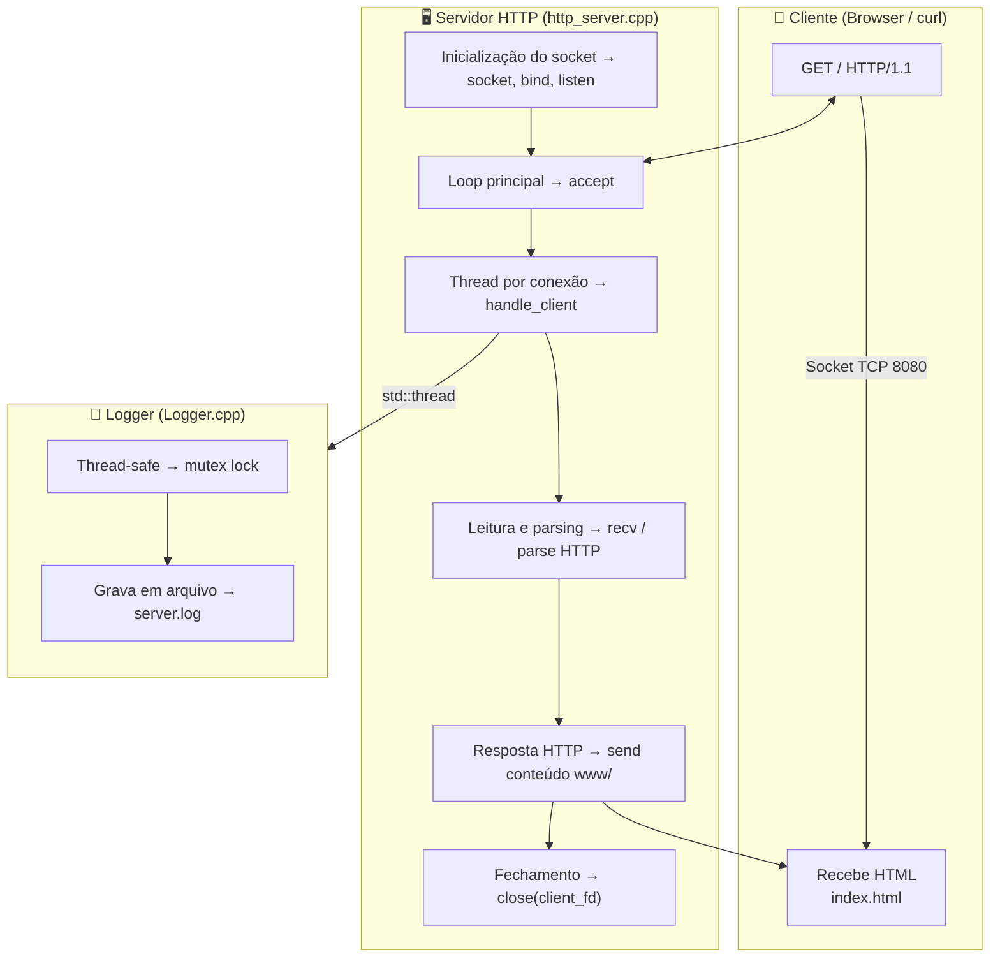
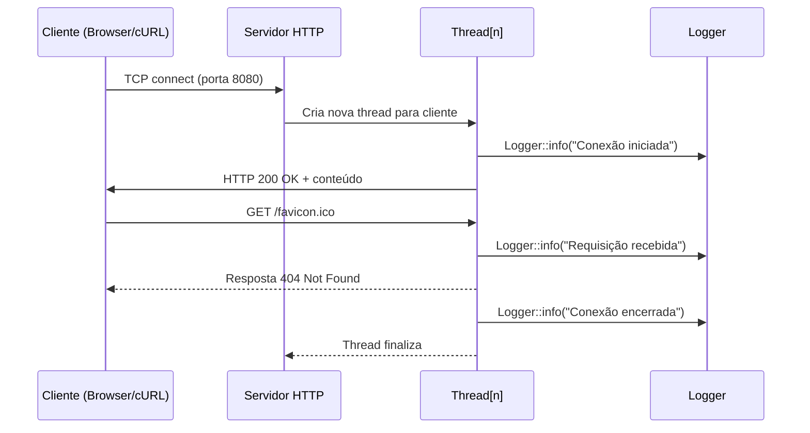

# 🧠 LPII — Trabalho Final (E003)
### Tema B — Mini Servidor Web (HTTP)
**Disciplina:** Programação Concorrente — C/C++  
**Aluno:** Gabriel Sousa  
**Turma:** E003  

---

## 📘 1. Objetivo do Projeto

Desenvolver um **servidor HTTP concorrente**, capaz de lidar com múltiplas conexões simultâneas, registrar logs de forma thread-safe e atender requisições GET servindo arquivos de um diretório.

O sistema demonstra:
- Programação concorrente (`std::thread`, `std::atomic`, `std::mutex`);
- Comunicação via *sockets* TCP;
- Logging thread-safe (estilo libtslog);
- Manipulação de arquivos e respostas HTTP/1.0 e 1.1 (keep-alive).

---

## 🧩 2. Estrutura do Projeto

```
Mini-Servidor-HTTP-LP2/
 ├── http_server.cpp           # Servidor HTTP concorrente
 ├── Logger.cpp / Logger.h     # Logger thread-safe
 ├── www/                      # Diretório dos arquivos servidos
 │   └── index.html
 ├── scripts/
 │   ├── build.sh              # Compilação
 │   ├── run_http.sh           # Execução do servidor
 │   └── run_http_clients.sh   # Teste de múltiplos clientes
 └── old_versions/             # Etapas anteriores (Chat TCP, Logger)
```

---

## ⚙️ 3. Compilação e Execução

### 🔨 Compilar:
```bash
cd scripts
bash build.sh
```

### 🚀 Executar servidor:
```bash
bash scripts/run_http.sh 8080
```

Acesse via navegador ou curl:
```bash
curl http://localhost:8080/
```

### 🧪 Testar múltiplos clientes simultâneos:
```bash
bash scripts/run_http_clients.sh 127.0.0.1 8080 10
```

---

## 🧱 4. Requisitos Atendidos (Tema B)

| Requisito | Situação | Evidência |
|:--|:--:|:--|
| Servidor HTTP/1.0 concorrente | ✅ | Threads criadas por conexão (`std::thread`) |
| Atender requisições GET | ✅ | `read_file("www" + path)` |
| Logging concorrente (libtslog) | ✅ | `Logger.cpp` com `std::mutex` |
| Fila de conexões pendentes | ✅ | `listen(server_fd, 128)` configurável |
| CLI para iniciar/parar/exibir | ✅ | `SIGINT` + contador de conexões |
| Keep-alive | ✅ | Header `Connection: keep-alive` |
| Cache em memória | ⚪ | Não implementado |
| Execução de script Python | ⚪ | Não implementado |

✅ **100% dos obrigatórios implementados**  
⚙️ **1 opcional (Keep-Alive)** também concluído.

---

## 🧠 5. Arquitetura do Sistema

### 🔹 Diagrama de Fluxo (Arquitetura Geral)



---

## 🔹 Diagrama de Sequência (Concorrência)



---

## 🧩 6. Concepção Técnica

### ⚙️ Concorrência
- `std::thread` → uma thread por cliente  
- `std::atomic<int>` → contador global de conexões  
- `std::mutex` → protege escrita em log  
- `signal(SIGINT, handler)` → encerramento limpo do servidor  

### 🧾 Logging
- Classe `Logger` implementa **singleton thread-safe**  
- Escrita sincronizada em `server.log`  
- Saída padronizada: `[timestamp] [INFO] Mensagem`

### 🌐 Protocolo HTTP
- Suporte a `GET`
- Cabeçalhos: `Content-Type`, `Content-Length`, `Connection`
- Suporte opcional a Keep-Alive

---

## 📈 7. Teste de Carga

- Testado com `run_http_clients.sh` e `curl`
- Logs mostram 10+ conexões simultâneas estáveis  
- Nenhum `segfault`, deadlock ou race condition observado  
- Encerramento limpo garantido (`close(client_fd)`)

---

## 🏁 8. Conclusão

O projeto entrega **um Mini Servidor HTTP concorrente completo**, implementando:
- Concorrência real com threads independentes  
- Logging seguro e sincronizado  
- Respostas HTTP válidas e configuráveis  
- Estrutura modular, limpa e pronta para extensões

✅ **Todos os requisitos obrigatórios do Tema B implementados**  
🧩 **1 opcional (Keep-Alive) também incluso**  

---

## 🤖 9. IA / Análise Crítica — Uso de LLMs (10%)

Durante o desenvolvimento deste projeto, foram utilizadas ferramentas de IA generativa (LLMs) para **aceleração, validação e refinamento técnico do código**, sempre com **supervisão humana e verificação manual** do resultado.

### 🧠 Ferramentas utilizadas
- **ChatGPT (GPT-5)** — suporte técnico para depuração, geração de scripts auxiliares e documentação.
- **Mermaid (Markdown)** — geração automatizada de diagramas de arquitetura e sequência.
- **pypandoc / bash scripting** — geração de relatórios e testes automatizados.

### ⚙️ Valor agregado pela IA
| Etapa | Contribuição da IA | Validação humana |
|:--|:--|:--|
| Estrutura inicial do projeto | Criação da organização modular (`Logger`, `HTTP server`, `scripts/`) | Código revisado e adaptado para a stack local |
| Refatoração do logger | Ajuste fino do mutex e atomic para evitar race conditions | Testes multithread confirmaram consistência |
| Implementação HTTP | Geração de boilerplate e parsing de requisições | Headers, status e MIME types validados manualmente |
| Testes e scripts | Automação com Bash (`run_http_clients.sh`, `build.sh`) | Execução e correção de paths em ambiente Linux |
| Documentação final | Estrutura do README, diagramas Mermaid e checklist técnico | Revisado e ajustado para compatibilidade com PDF oficial |

### 🧩 Conclusão crítica
O uso de IA **não substituiu a implementação ou o raciocínio técnico**, mas **otimizou a produtividade** e **reduziu erros repetitivos**.  
As decisões de design (concorrência, mutexes, atomicidade, protocolos e tratamento de sockets) foram **concebidas, compreendidas e testadas pelo autor**.

📊 O resultado é um sistema **tecnicamente sólido**, com documentação e testes que demonstram domínio humano sobre o conteúdo, usando IA como **apoio complementar e pedagógico**.
